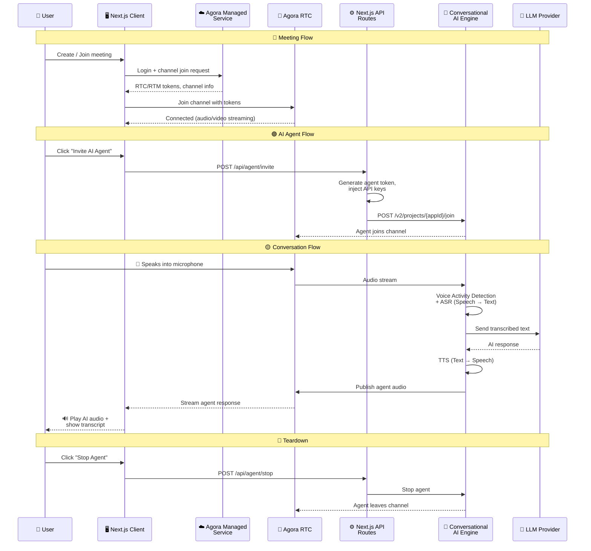

<p align="center">
  
</p>

<h1 align="center">🎙️ My Agora AI App</h1>

<p align="center">
  <b>A real-time communication app built with Next.js, TypeScript & Agora SDKs</b><br/>
  Video calls · Voice calls · Real-time messaging · Whiteboard · AI Conversational Agent
</p>

<p align="center">
  
  
  
  
  
</p>

---

## 📖 Overview

This app delivers a **production-ready real-time communication experience** powered by Agora's Managed Service. Users can create or join video meetings with screen sharing, an interactive whiteboard, host controls, and real-time messaging.

On top of the RTC foundation, the app integrates **Agora Conversational AI** — letting you invite an AI agent into any call. The agent uses configurable LLM, TTS, and ASR providers, supports AI avatars (HeyGen, Akool, Anam), and can call external tools via **MCP (Model Context Protocol)** servers.

All secret keys stay on the server. Next.js API routes generate Agora tokens, inject API keys, and proxy requests to the [Agora Conversational AI v2.5 API](https://docs.agora.io/en/conversational-ai/overview/product-overview).

---

## ✨ Features

| Feature                        | Description                                            |
| ------------------------------ | ------------------------------------------------------ |
| 🎥 **Video & Voice Calling**   | HD video/voice calls powered by Agora RTC SDK          |
| 🖥️ **Screen Sharing**          | Share your screen with participants in real time       |
| 💬 **Real-time Messaging**     | Instant chat using Agora RTM SDK v2                    |
| 🎨 **Interactive Whiteboard**  | Collaborate visually with Netless Fastboard            |
| 🤖 **AI Conversational Agent** | Talk to an AI agent with LLM, TTS & ASR support        |
| 🖼️ **AI Avatars**              | Optional avatar integration (HeyGen, Akool, Anam)      |
| 🔐 **Google Auth**             | Sign in with Google via NextAuth.js                    |
| 🌙 **Dark Mode**               | Full dark mode support with Tailwind                   |
| 🔌 **MCP Tools**               | Model Context Protocol server for AI-powered tooling   |
| ⚡ **Modern Stack**            | Next.js 15, React 19, TypeScript, Zustand, React Query |

---

## 🛠️ Tech Stack

| Layer          | Technologies                                                                                                           |
| -------------- | ---------------------------------------------------------------------------------------------------------------------- |
| **Framework**  | Next.js 15 · React 19 · TypeScript 5.8                                                                                 |
| **Styling**    | TailwindCSS 4 · Dark mode (class strategy)                                                                             |
| **State**      | Zustand 5 · TanStack React Query                                                                                       |
| **Auth**       | NextAuth.js (Google OAuth)                                                                                             |
| **Agora SDKs** | `agora-rtc-sdk-ng` · `agora-rtm-sdk` v2 · `@netless/fastboard-react`                                                   |
| **AI**         | Conversational AI · LLM (OpenAI/Anthropic/Gemini) · TTS (ElevenLabs/Microsoft/OpenAI) · ASR (Deepgram/Microsoft/Agora) |

---

## 🏗️ Architecture



> 💡 **How it works:** The project is created via [Agora App Builder](https://appbuilder.agora.io/), which provisions the Managed Service backend. The Next.js client communicates with the Managed Service for authentication and channel management. For AI features, Next.js API routes act as a secure proxy — generating tokens server-side and forwarding requests to Agora's Conversational AI Engine.

---

## 📋 Prerequisites

Before getting started, make sure you have:

- ✅ **Node.js** v18 or higher
- ✅ **npm** or **yarn**
- ✅ **Google Cloud** credentials (for OAuth sign-in)

### 🔑 Agora Account Setup

Follow these steps **in order** to set up your Agora project:

#### Step 1 — Create a project via App Builder

1. Go to 👉 [**Agora App Builder**](https://appbuilder.agora.io/)
2. Sign up or log in to your Agora account
3. Create a new project — this generates your **App ID** and **Project ID**

#### Step 2 — Enable RTM & Conversational AI

1. Go to 👉 [**Agora Console**](https://console.agora.io/)
2. Navigate to your project settings
3. ✅ **Enable Real-Time Messaging (RTM)** — required for chat functionality
4. ✅ **Enable Conversational AI** — required for the AI agent feature
5. 📜 Copy your **App Certificate** from Project Management → Security

#### Step 3 — Get RESTful API Credentials

1. Go to 👉 [**Agora RESTful API**](https://console.agora.io/restful-api)
2. Generate or copy the following:
   - 🆔 **Customer ID**
   - 🔐 **Customer Secret (Certificate)**
3. These are needed for server-side token generation and Conversational AI API calls

> 💡 **Tip:** The project is created via **App Builder**, but feature enablement (RTM, Conversational AI), the **App Certificate**, and **RESTful API credentials** are all managed in the **Agora Console**.

---

## 🚀 Getting Started

### 1️⃣ Clone the repository

```bash
git clone <repository-url>
cd my-agora-app
```

### 2️⃣ Install dependencies

```bash
npm install
```

### 3️⃣ Configure environment variables

```bash
cp .env.example .env
```

Edit `.env` with your credentials:

<details>
<summary>🔧 <b>Core Agora & Auth Variables</b></summary>

```env
# Google Auth (NextAuth.js)
AUTH_SECRET="generated-secret"          # Run: openssl rand -base64 32
GOOGLE_CLIENT_ID="your-google-client-id"
GOOGLE_CLIENT_SECRET="your-google-client-secret"

# Agora Core
NEXT_PUBLIC_AGORA_APP_ID="your-app-id"
NEXT_PUBLIC_AGORA_PROJECT_ID="your-project-id"
NEXT_PUBLIC_AGORA_MANAGED_SERVICE_URL="https://managedservices-prod.rteappbuilder.com/v1"

# Agora Server-only (token gen & Conversational AI)
AGORA_APP_CERTIFICATE="your-app-certificate"   # From Agora Console → Project → Security
AGORA_CUSTOMER_ID="your-customer-id"
AGORA_CUSTOMER_SECRET="your-customer-secret"

# Whiteboard
NEXT_PUBLIC_AGORA_WHITEBOARD_APPIDENTIFIER="your-whiteboard-app-id"
NEXT_PUBLIC_AGORA_WHITEBOARD_REGION="us-sv"
```

</details>

<details>
<summary>🤖 <b>AI Agent Variables (Optional)</b></summary>

```env
# LLM
NEXT_PUBLIC_LLM_VENDOR="openai"
NEXT_PUBLIC_LLM_MODEL="gpt-4o-mini"
LLM_API_KEY="your-llm-api-key"

# TTS
NEXT_PUBLIC_TTS_VENDOR="elevenlabs"
ELEVENLABS_API_KEY="your-elevenlabs-key"

# ASR
NEXT_PUBLIC_ASR_VENDOR="ares"

# Avatars (pick one, all optional)
HEYGEN_API_KEY="your-heygen-key"
AKOOL_API_KEY="your-akool-key"
ANAM_API_KEY="your-anam-key"
```

</details>

<details>
<summary>📍 <b>Where to find each value</b></summary>

| Variable                         | Where to get it                                                                           |
| -------------------------------- | ----------------------------------------------------------------------------------------- |
| `NEXT_PUBLIC_AGORA_APP_ID`       | [Agora Console](https://console.agora.io/) → Project Management                           |
| `NEXT_PUBLIC_AGORA_PROJECT_ID`   | [Agora App Builder](https://appbuilder.agora.io/) → Your Project                          |
| `AGORA_APP_CERTIFICATE`          | [Agora Console](https://console.agora.io/) → Project Management → Security                |
| `AGORA_CUSTOMER_ID` / `SECRET`   | [Agora RESTful API](https://console.agora.io/restful-api)                                 |
| `NEXT_PUBLIC_AGORA_WHITEBOARD_*` | [Agora Console](https://console.agora.io/) → Whiteboard → Config                          |
| `GOOGLE_CLIENT_ID` / `SECRET`    | [Google Cloud Console](https://console.cloud.google.com/) → APIs & Services → Credentials |

</details>

### 4️⃣ Start the development server

```bash
npm run dev
```

### 5️⃣ Open your browser

Navigate to 👉 `http://localhost:3000`

---

## 📜 Available Scripts

| Command         | Description                 |
| --------------- | --------------------------- |
| `npm run dev`   | 🔄 Start development server |
| `npm run build` | 📦 Build for production     |
| `npm run start` | 🚀 Start production server  |
| `npm run lint`  | 🔍 Run ESLint               |

---

## 📁 Project Structure

```
my-agora-app/
├── src/
│   ├── app/           # Next.js App Router pages & API routes
│   ├── components/    # React components
│   │   └── common/    # Reusable UI (Button, Card, Modal, InputField)
│   ├── hooks/         # Custom React hooks (useAgora)
│   ├── services/      # Utility services (uiService)
│   ├── store/         # Zustand stores
│   └── types/         # TypeScript definitions
├── public/            # Static assets
├── .env.example       # Environment variable template
└── package.json
```

---

## 📄 License

MIT
