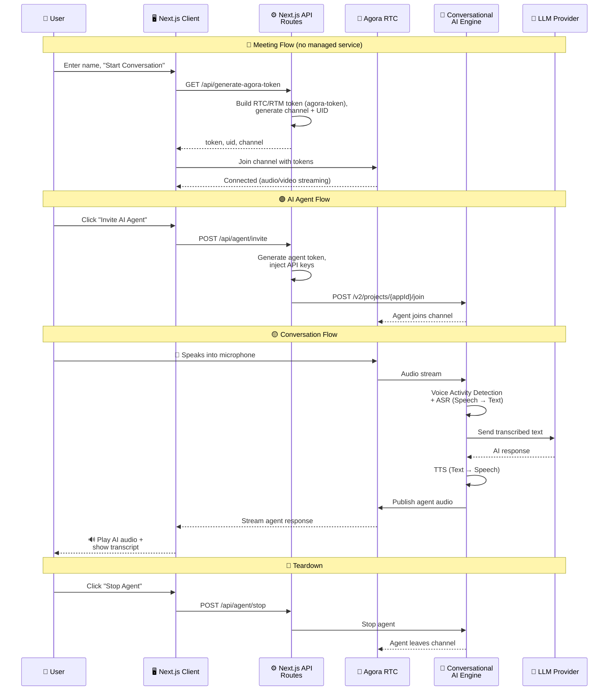

<p align="center">
  
</p>

<h1 align="center">🎙️ My Agora AI App</h1>

<p align="center">
  <b>A real-time communication app built with Next.js, TypeScript & Agora SDKs</b><br/>
  Video calls · Voice calls · Real-time messaging · AI Conversational Agent
</p>

<p align="center">
  
  
  
  
  
</p>

---

## 📖 Overview

This app delivers a **production-ready real-time communication experience** powered by Agora. Users can create or join video meetings with screen sharing, host controls, and real-time messaging.

On top of the RTC foundation, the app integrates **Agora Conversational AI** — letting you invite an AI agent into any call. The agent uses configurable LLM, TTS, and ASR providers, supports AI avatars (HeyGen, Akool, Anam), and can call external tools via **MCP (Model Context Protocol)** servers.

All secret keys stay on the server. Next.js API routes generate Agora tokens, inject API keys, and proxy requests to the [Agora Conversational AI v2 API](https://docs.agora.io/en/conversational-ai/overview/product-overview).

---

## ✨ Features

| Feature                        | Description                                            |
| ------------------------------ | ------------------------------------------------------ |
| 🎥 **Video & Voice Calling**   | HD video/voice calls powered by Agora RTC SDK          |
| 🖥️ **Screen Sharing**          | Share your screen with participants in real time       |
| 💬 **Real-time Messaging**     | Instant chat using Agora RTM SDK v2                    |
| 🤖 **AI Conversational Agent** | Talk to an AI agent with LLM, TTS & ASR support        |
| 🖼️ **AI Avatars**              | Optional avatar integration (HeyGen, Akool, Anam)      |
| 🌙 **Dark Mode**               | Full dark mode support with Tailwind                   |
| 🔌 **MCP Tools**               | Model Context Protocol server for AI-powered tooling   |
| ⚡ **Modern Stack**            | Next.js 15, React 19, TypeScript, Zustand, React Query |

---

## 🛠️ Tech Stack

| Layer          | Technologies                                                                                                           |
| -------------- | ---------------------------------------------------------------------------------------------------------------------- |
| **Framework**  | Next.js 15 · React 19 · TypeScript 5.8                                                                                 |
| **Styling**    | TailwindCSS 4 · Dark mode (class strategy)                                                                             |
| **State**      | Zustand 5 · TanStack React Query                                                                                       |
| **Agora SDKs** | `agora-rtc-sdk-ng` · `agora-rtm-sdk` v2                                                                               |
| **AI**         | Conversational AI · LLM (OpenAI/Anthropic/Gemini) · TTS (ElevenLabs/Microsoft/OpenAI) · ASR (Deepgram/Microsoft/Agora) |

---

## 🏗️ Architecture



> 💡 **How it works:** Tokens are generated server-side by Next.js API routes using the `agora-token` library (no Agora Managed Service). The client fetches `/api/generate-agora-token` for RTC/RTM tokens and channel info, then joins the Agora channel. For the AI agent, API routes generate agent tokens and inject API keys, then call Agora's Conversational AI Engine.

---

## 📋 Prerequisites

Before getting started, make sure you have:

- ✅ **Node.js** v18 or higher
- ✅ **npm** or **yarn**

### 🔑 Agora Account Setup

Follow these steps **in order** to set up your Agora project:

#### Step 1 — Create a project in Agora Console

1. Go to 👉 [**Agora Console**](https://console.agora.io/)
2. Sign up or log in and create a new project
3. Copy your **App ID** from Project Management

#### Step 2 — Enable RTM & Conversational AI

1. In your project settings in [Agora Console](https://console.agora.io/), enable:
   - ✅ **Real-Time Messaging (RTM)** — for chat
   - ✅ **Conversational AI** — for the AI agent
2. Copy your **App Certificate** from Project Management → Security

#### Step 3 — Get RESTful API credentials

1. Go to [**Agora RESTful API**](https://console.agora.io/restful-api)
2. Copy your **Customer ID** and **Customer Secret** — required for token generation and Conversational AI API calls

---

## 🚀 Getting Started

### 1️⃣ Clone the repository

```bash
git clone <repository-url>
cd my-agora-app
```

### 2️⃣ Install dependencies

```bash
npm install
```

### 3️⃣ Configure environment variables

```bash
cp .env.example .env
```

Edit `.env` and add your keys. **Minimum to run the app:**

- **Agora (required):** `NEXT_PUBLIC_AGORA_APP_ID`, `AGORA_APP_CERTIFICATE`, `AGORA_CUSTOMER_ID`, `AGORA_CUSTOMER_SECRET` — then you can create/join meetings and use voice/video.
- **AI agent (optional):** Set `LLM_API_KEY` and one TTS key (e.g. `ELEVENLABS_API_KEY`) to invite the conversational AI agent. Other LLM/TTS/ASR/avatar vars in `.env.example` are optional defaults.

| Variable                     | Where to get it                                                                 |
| ---------------------------- | ------------------------------------------------------------------------------- |
| `NEXT_PUBLIC_AGORA_APP_ID`   | [Agora Console](https://console.agora.io/) → Project Management                |
| `AGORA_APP_CERTIFICATE`      | [Agora Console](https://console.agora.io/) → Project → Security                |
| `AGORA_CUSTOMER_ID` / `SECRET` | [Agora RESTful API](https://console.agora.io/restful-api)                     |

All supported variables (LLM, TTS, ASR, avatars) are listed in `.env.example` with empty values — fill only what you need.

### 4️⃣ Start the development server

```bash
npm run dev
```

### 5️⃣ Open your browser

Navigate to 👉 `http://localhost:3000`

---

## 📜 Available Scripts

| Command         | Description                 |
| --------------- | --------------------------- |
| `npm run dev`   | 🔄 Start development server |
| `npm run build` | 📦 Build for production     |
| `npm run start` | 🚀 Start production server  |
| `npm run lint`  | 🔍 Run ESLint               |

---

## 📁 Project Structure

```
my-agora-app/
├── src/
│   ├── app/           # Next.js App Router pages & API routes
│   ├── components/    # React components
│   │   └── common/    # Reusable UI (Button, Card, Modal, InputField)
│   ├── hooks/         # Custom React hooks (useAgora)
│   ├── services/      # Utility services (uiService)
│   ├── store/         # Zustand stores
│   └── types/         # TypeScript definitions
├── public/            # Static assets
├── .env.example       # Environment variable template
└── package.json
```

---

## 📄 License

MIT
