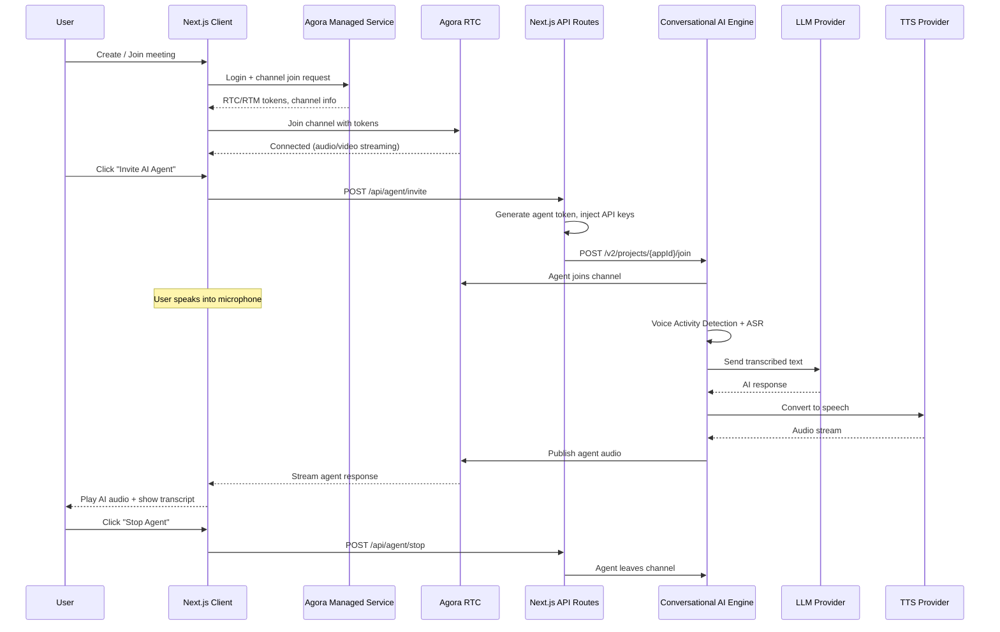

# My Agora AI App

A Next.js application combining **Agora App Builder RTC** with **Conversational AI** — featuring video calling, AI agents, avatars, and real-time collaboration tools.

## Overview

This app delivers a production-ready **real-time communication experience** powered by Agora's Managed Service. Users can create or join video meetings with screen sharing, an interactive whiteboard, host controls, and real-time messaging.

On top of the RTC foundation, the app integrates **Agora Conversational AI** — letting you invite an AI agent into any call. The agent uses configurable LLM, TTS, and ASR providers, supports AI avatars (HeyGen, Akool, Anam), and can call external tools via MCP (Model Context Protocol) servers.

All secrets stay on the server. Next.js API routes generate Agora tokens, inject API keys, and proxy requests to the Agora Conversational AI v2 API — so nothing sensitive reaches the browser.

## Features

### RTC & Collaboration
- **Video & voice calling** — HD audio/video with dynamic grid layout (1-7 participants)
- **Screen sharing** — share your screen with automatic layout switching
- **Interactive whiteboard** — real-time collaborative drawing (Netless Fastboard)
- **Chat messaging** — real-time messaging via Agora RTM
- **Host controls** — mute/unmute remote participants with accept/decline requests
- **Session timer** — 15-minute auto-expiry with countdown display

### Conversational AI
- **AI agent lifecycle** — invite, update, query, and stop agents from the UI
- **Multi-vendor LLM** — OpenAI, Azure OpenAI, Anthropic, Gemini, Groq, Coze, Dify, MiniMax, or custom
- **Multi-vendor TTS** — Microsoft, ElevenLabs, OpenAI, MiniMax, Cartesia, Fish Audio, Google, Polly
- **Multi-vendor ASR** — Agora ARES (built-in), Deepgram, Microsoft
- **Real-time transcription** — dual mode (RTM for agent state + RTC for audio-only)
- **ElevenLabs voice picker** — browse and preview voices with audio samples
- **MCP tool integration** — connect external MCP servers for function calling
- **Advanced settings** — VAD turn detection, filler words, SAL (Selective Attention Locking), custom JSON payloads
- **Image modality** — send pictures to the AI agent (MLLM support)

### AI Avatars
- **HeyGen** — 30+ streaming avatars across categories (characters, doctors, fitness, lawyers, etc.)
- **Akool** — custom avatar support
- **Anam** — 7 stock avatars (Gabriel, Layla, Cara, Mila, Liv, Kevin, Leo)

### App Experience
- **Google OAuth** — sign-in via NextAuth.js v5
- **Dark mode** — system-aware with manual toggle
- **Feature tour** — guided onboarding for new users
- **Responsive design** — mobile-first with adaptive layouts

## Architecture



## Tech Stack

| Category | Technology |
|----------|-----------|
| Framework | Next.js 15 (App Router), React 19, TypeScript 5.8 |
| Styling | TailwindCSS 4, dark mode (class strategy) |
| State | Zustand 5, TanStack React Query |
| Auth | NextAuth.js v5 (Google OAuth) |
| Video/Audio | agora-rtc-sdk-ng |
| Messaging | agora-rtm-sdk v2 |
| Whiteboard | @netless/fastboard-react |
| Token Generation | agora-token (server-side) |

## Getting Started

### Prerequisites
- Node.js 18+
- An [Agora account](https://console.agora.io/) with App ID, App Certificate, and Customer ID/Secret
- [Google OAuth credentials](https://console.cloud.google.com/) (APIs & Services > Credentials > OAuth 2.0 Client ID)

### Setup

```bash
# 1. Clone the repo
git clone <repo-url>
cd my-agora-app

# 2. Install dependencies
npm install

# 3. Configure environment
cp .env.example .env
# Fill in your credentials (see Environment Variables below)

# 4. Start dev server
npm run dev
```

Open [http://localhost:3000](http://localhost:3000), sign in with Google, and create or join a meeting.

## Environment Variables

Copy `.env.example` to `.env` and fill in the values. Variables prefixed with `NEXT_PUBLIC_` are visible to the browser. Variables **without** the prefix are server-only and never reach the client.

### Auth (NextAuth.js)

| Variable | Description | Required |
|----------|-------------|----------|
| `AUTH_SECRET` | NextAuth secret — generate with `openssl rand -base64 32` | Yes |
| `GOOGLE_CLIENT_ID` | Google OAuth Client ID | Yes |
| `GOOGLE_CLIENT_SECRET` | Google OAuth Client Secret | Yes |

### Agora Core

| Variable | Description | Required |
|----------|-------------|----------|
| `NEXT_PUBLIC_AGORA_APP_ID` | Agora App ID | Yes |
| `NEXT_PUBLIC_AGORA_API_KEY` | Agora API Key | Yes |
| `NEXT_PUBLIC_AGORA_MANAGED_SERVICE_URL` | Managed Service URL (default provided) | Yes |
| `NEXT_PUBLIC_AGORA_PROJECT_ID` | App Builder Project ID — create at [appbuilder.agora.io](https://appbuilder.agora.io/) | Yes |
| `AGORA_APP_CERTIFICATE` | App Certificate — server-only, for token generation | Yes |
| `AGORA_CUSTOMER_ID` | RESTful API Customer ID — server-only | For AI agent |
| `AGORA_CUSTOMER_SECRET` | RESTful API Customer Secret — server-only | For AI agent |

### Whiteboard

| Variable | Description | Required |
|----------|-------------|----------|
| `NEXT_PUBLIC_AGORA_WHITEBOARD_APPIDENTIFIER` | Whiteboard App Identifier | For whiteboard |
| `NEXT_PUBLIC_AGORA_WHITEBOARD_REGION` | Region: `us-sv`, `sg`, `cn-hz`, `in-mum`, `eu` | For whiteboard |

### LLM (AI Agent)

| Variable | Description | Required |
|----------|-------------|----------|
| `NEXT_PUBLIC_LLM_VENDOR` | Provider: `openai`, `azure`, `anthropic`, `gemini`, `groq`, `custom` | No (default: openai) |
| `NEXT_PUBLIC_LLM_URL` | LLM API endpoint URL | No |
| `NEXT_PUBLIC_LLM_MODEL` | Model name (e.g. `gpt-4o-mini`) | No |
| `LLM_API_KEY` | LLM API key — server-only | For AI agent |

### TTS (Text-to-Speech)

| Variable | Description | Required |
|----------|-------------|----------|
| `NEXT_PUBLIC_TTS_VENDOR` | Provider: `microsoft`, `elevenlabs`, `openai` | No (default: elevenlabs) |
| `NEXT_PUBLIC_ELEVENLABS_VOICE_ID` | ElevenLabs voice ID | For ElevenLabs |
| `NEXT_PUBLIC_ELEVENLABS_MODEL_ID` | ElevenLabs model | No |
| `NEXT_PUBLIC_ELEVENLABS_SAMPLE_RATE` | Sample rate in Hz | No (default: 24000) |
| `ELEVENLABS_API_KEY` | ElevenLabs API key — server-only | For ElevenLabs |
| `MICROSOFT_TTS_KEY` | Microsoft TTS key — server-only | For Microsoft |
| `OPENAI_TTS_KEY` | OpenAI TTS key — server-only | For OpenAI |

### ASR (Speech Recognition)

| Variable | Description | Required |
|----------|-------------|----------|
| `NEXT_PUBLIC_ASR_VENDOR` | Provider: `ares`, `deepgram`, `microsoft` | No (default: ares) |
| `NEXT_PUBLIC_ASR_LANGUAGE` | Language code (e.g. `en-US`) | No |
| `DEEPGRAM_API_KEY` | Deepgram API key — server-only | For Deepgram |
| `MICROSOFT_ASR_KEY` | Microsoft ASR key — server-only | For Microsoft |

### AI Avatars (Optional)

| Variable | Description | Required |
|----------|-------------|----------|
| `NEXT_PUBLIC_HEYGEN_AVATAR_ID` | HeyGen streaming avatar ID | For HeyGen |
| `NEXT_PUBLIC_HEYGEN_QUALITY` | Quality: `medium`, `high` | No (default: medium) |
| `HEYGEN_API_KEY` | HeyGen API key — server-only | For HeyGen |
| `NEXT_PUBLIC_AKOOL_AVATAR_ID` | Akool avatar ID | For Akool |
| `AKOOL_API_KEY` | Akool API key — server-only | For Akool |
| `NEXT_PUBLIC_ANAM_AVATAR_ID` | Anam avatar UUID | For Anam |
| `ANAM_API_KEY` | Anam API key — server-only | For Anam |

## Project Structure

```
my-agora-app/
├── app/                           # Next.js App Router
│   ├── api/
│   │   ├── agent/                 # AI agent endpoints
│   │   │   ├── invite/            #   POST — invite agent to call
│   │   │   ├── stop/              #   POST — remove agent
│   │   │   ├── update/            #   POST — update agent config
│   │   │   └── query/             #   GET  — check agent status
│   │   ├── auth/[...nextauth]/    # Google OAuth handlers
│   │   ├── mcp/tools/             # MCP tool discovery proxy
│   │   ├── tts/elevenlabs-voices/ # ElevenLabs voice list
│   │   └── upload/                # Image upload for AI vision
│   ├── call/                      # Video call page
│   ├── join/                      # Join meeting page
│   └── page.tsx                   # Landing / create meeting
├── src/
│   ├── api/
│   │   ├── agoraApi.ts            # Managed Service client (create/join)
│   │   └── agentApi.ts            # Agent lifecycle client
│   ├── components/
│   │   ├── common/                # Button, Modal, Card, InputField, etc.
│   │   ├── Controls.tsx           # Call control bar
│   │   ├── VideoTile.tsx          # Participant video
│   │   ├── AgentTile.tsx          # AI agent status display
│   │   ├── SettingsSidebar.tsx    # Agent settings panel
│   │   ├── TranscriptSidePanel.tsx# Live transcript + chat
│   │   ├── Whiteboard.tsx         # Fastboard integration
│   │   └── FeatureTour/           # Guided onboarding
│   ├── hooks/
│   │   ├── useAgora.ts            # RTC/RTM client management
│   │   └── useConversationalAI.ts # Transcript handling
│   ├── screens/                   # Page-level components
│   │   ├── LandingScreen.tsx
│   │   ├── CreateMeetingScreen.tsx
│   │   ├── JoinMeetingScreen.tsx
│   │   └── VideoCallScreen.tsx
│   ├── store/useAppStore.tsx      # Zustand global store
│   ├── types/agora.ts             # TypeScript definitions
│   └── services/uiService.ts     # Toast notifications
├── .env.example                   # Environment template
├── next.config.ts
├── tailwind.config.js
├── tsconfig.json
└── package.json
```

## Scripts

| Command | Description |
|---------|-------------|
| `npm run dev` | Start development server |
| `npm run build` | Build for production |
| `npm run start` | Start production server |
| `npm run lint` | Run ESLint |

## License

MIT
