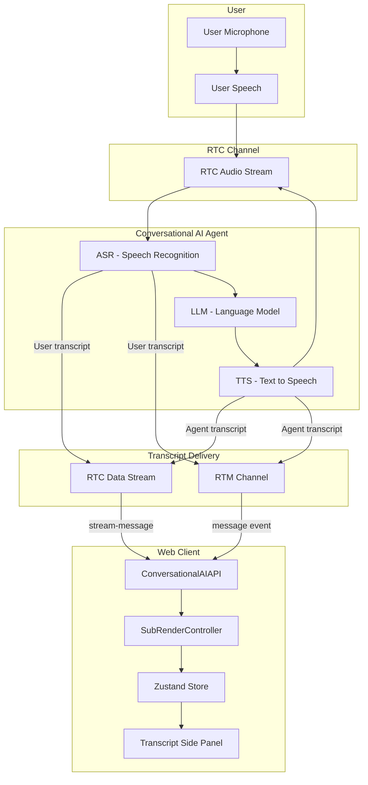

# Live Transcript / Subtitles Guide

This document explains how live subtitles work in My Agora App, covering both RTC and RTM modes, the `conversational-ai-api` toolkit, and the end-to-end text flow from user to agent and back to the transcript panel.

---

## Table of Contents

1. [Overview](#overview)
2. [Transmission Modes: RTC vs RTM](#transmission-modes-rtc-vs-rtm)
3. [What Works in Each Mode](#what-works-in-each-mode)
4. [Text Flow Diagram](#text-flow-diagram)
5. [The Conversational AI API Toolkit](#the-conversational-ai-api-toolkit)
6. [Implementation Architecture](#implementation-architecture)
7. [External Resources](#external-resources)

---

## Overview

Our app supports **live subtitles** (transcripts) during voice conversations with an AI agent. Subtitles appear in real time as:

- **User speaks** → User’s words are transcribed and shown.
- **Agent speaks** → Agent’s response is streamed and shown.

Subtitles work in **both** RTC and RTM modes. The mode is chosen when starting the agent and affects how transcript data is delivered.

---

## Transmission Modes: RTC vs RTM

### RTC Mode (Data Stream)

- **Agent config:** `advanced_features.enable_rtm: false`, `parameters.data_channel: "datastream"` (default)
- **Delivery:** Transcripts are sent over the **RTC data stream** (`stream-message` events).
- **Format:** Chunked: `message_id|chunk_index|total_chunks|base64_payload`
- **Token:** RTC-only token (via `buildTokenWithUid`).

### RTM Mode (Signaling)

- **Agent config:** `advanced_features.enable_rtm: true`, `parameters.data_channel: "rtm"`
- **Delivery:** Transcripts are sent over **RTM (Signaling)** channel messages.
- **Format:** Plain JSON.
- **Token:** RTC + RTM token (via `buildTokenWithRtm` so the agent can join both RTC and Signaling).

---

## What Works in Each Mode

| Feature | RTC Mode | RTM Mode |
|---------|----------|----------|
| **Live subtitles (user + agent)** | ✅ | ✅ |
| **Agent state (idle, speaking, thinking)** | ✅ | ✅ |
| **Send text chat to agent** | ❌ | ✅ (UI enabled; needs `agent_rtm_uid` for full support) |
| **Send image to agent** | ❌ | ✅ (UI enabled; same caveat) |
| **Message receipt / error events** | ❌ | ✅ (toolkit supports; wiring optional) |
| **Agent metrics** | ❌ | ✅ (if `enable_metrics: true`) |
| **Agent error events** | ❌ | ✅ (if `enable_error_message: true`) |
| **Interruption handling** | ✅ | ✅ |

---

## Text Flow Diagram

The following diagram shows how text flows from user speech to agent response and back to the transcript panel.



### Flow Summary

1. **User speaks** → Audio is sent over RTC to the agent.
2. **Agent ASR** transcribes user speech → User transcript is sent via RTC stream or RTM.
3. **Agent LLM** responds → **Agent TTS** converts to speech and sends back over RTC.
4. **Agent TTS** produces transcript → Agent transcript is sent via RTC stream or RTM.
5. **ConversationalAIAPI** receives and parses transcripts → Updates **SubRenderController**.
6. **SubRenderController** updates the store → **TranscriptSidePanel** shows live subtitles.

---

## The Conversational AI API Toolkit

### What Is It?

`src/conversational-ai-api` is a small toolkit that sits between Agora (RTC/RTM) and our UI. It:

- Listens for transcript messages from RTC and RTM
- Parses them (including the RTC chunked format)
- Normalizes them into a common format for the UI
- Manages render modes (text vs word-by-word)
- Emits events for transcript updates and agent state

### Why Do We Need It?

Agora sends transcript data in different formats depending on mode:

- **RTC:** Chunked (`message_id|chunk_index|total_chunks|base64_payload`)
- **RTM:** Plain JSON

The toolkit handles both so the rest of the app only deals with a single, clean stream of transcript items.

### Folder Structure

```
src/conversational-ai-api/
├── index.ts          # Main API class (ConversationalAIAPI)
├── type.ts           # Enums and types (EMessageType, ETranscriptHelperMode, etc.)
└── utils/
    ├── events.ts     # Event helper for on/off/emit
    ├── sub-render.ts # SubRenderController - processes transcript messages
    └── logger.ts     # Optional logging
```

### How It Works (Simple)

1. **Init:** We pass `rtcEngine`, `rtmEngine`, and `renderMode` to `ConversationalAIAPI.init()`.
2. **Subscribe:** We call `api.subscribeMessage(channelId)` so it listens on the channel.
3. **Events:** The API emits:
   - `TRANSCRIPT_UPDATED` → Full transcript list (completed + in-progress)
   - `AGENT_STATE_CHANGED` → Agent state (idle, speaking, thinking)
4. **Unsubscribe:** When the agent session ends, we call `api.unsubscribe()`.

The toolkit is largely stateless from the app’s perspective: we init once, subscribe, listen for events, and update the store. The panel reads from the store and renders.

---

## Implementation Architecture

### Main Components

| Component | Location | Role |
|-----------|----------|------|
| **ConversationalAIAPI** | `src/conversational-ai-api/index.ts` | Receives RTC/RTM messages, parses, emits events |
| **SubRenderController** | `src/conversational-ai-api/utils/sub-render.ts` | Builds transcript items (user/agent), handles status |
| **useConversationalAI** | `src/hooks/useConversationalAI.ts` | Hooks the toolkit to the app, handles `sendChatMessage` |
| **TranscriptSidePanel** | `src/components/TranscriptSidePanel.tsx` | UI for live subtitles and chat input (RTM) |
| **useAppStore** | `src/store/useAppStore.tsx` | Holds `transcriptItems`, `currentInProgressMessage`, `transcriptionMode` |

### RTC Chunked Format Parsing

RTC datastream messages use this format:

```
message_id|chunk_index|total_chunks|base64_payload
```

Example: `8686561c|3|3|eyJvYmplY3QiOi...`

- **Single chunk:** Decode base64 and parse JSON immediately.
- **Multiple chunks:** Cache by `message_id`, reassemble when all chunks are received, then decode and parse.

### Token Requirements

- **RTC mode:** `RtcTokenBuilder.buildTokenWithUid()` (RTC only).
- **RTM mode:** `RtcTokenBuilder.buildTokenWithRtm()` (RTC + Signaling). See [Agora token doc](https://docs.agora.io/en/help/integration-issues/rtc_rtm_token).

---

## External Resources

| Resource | Description |
|----------|-------------|
| [Agora – Display live transcripts](https://docs.agora.io/en/conversational-ai/develop/transcripts) | Official transcript integration guide |
| [Agora – RTC + RTM token](https://docs.agora.io/en/help/integration-issues/rtc_rtm_token) | How to generate a token with both RTC and Signaling privileges |
| [Agora – Start a conversational AI agent (Join API)](https://docs.agora.io/en/conversational-ai/rest-api/agent/join) | Agent join REST API reference |
| [Agora – Transmit custom information](https://docs.agora.io/en/conversational-ai/develop/custom-information) | Custom info and `agent_rtm_uid` (when available) |
| [Conversational AI Demo (Web)](https://github.com/AgoraIO-Community/Conversational-AI-Demo) | Reference implementation including `conversational-ai-api` |

---

## Quick Reference

- **Enable live subtitles:** Start an AI agent; the transcript panel shows subtitles in both RTC and RTM modes.
- **Switch mode:** Choose RTC or RTM in Agent Settings before starting the agent.
- **Render mode:** Use Text (full sentence), Word (word-by-word), or Auto in the transcript panel.
- **Send chat (RTM):** In RTM mode, the transcript panel shows a text input. Sending requires proper agent configuration (e.g. `agent_rtm_uid` when supported by Agora).
